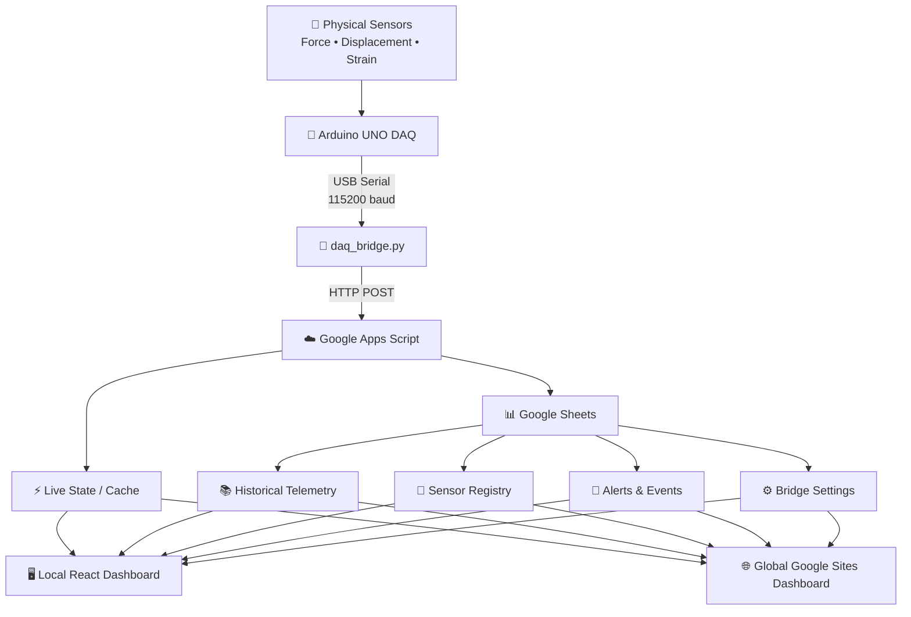
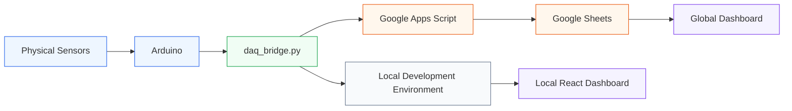
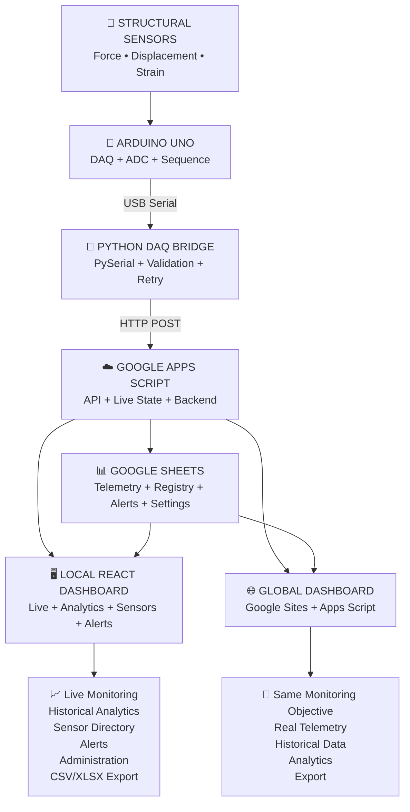

# 🌉 LIVE DAQ DASHBOARD

### Real-Time Bridge Structural Health Monitoring & Data Acquisition System

**LIVE DAQ DASHBOARD** is an end-to-end **Bridge Structural Health Monitoring (SHM)** and **Data Acquisition (DAQ)** platform that collects real sensor measurements from an Arduino-based acquisition system, transfers the data through a Python communication bridge, stores telemetry in Google Sheets through Google Apps Script, and presents the information through a professional web dashboard.

The system is designed for monitoring structural parameters such as:

* ⚙️ **Force / Load**
* 📏 **Displacement**
* 📐 **Strain**
* 🌡️ Temperature
* 💧 Humidity
* 🔌 Sensor and DAQ connectivity
* 🚨 Structural/system alerts

> **Core principle:** Production telemetry must come from the physical sensors and Arduino DAQ. The system must not rely on random, fabricated, or simulated sensor values.

---

## 📌 Table of Contents

* [Project Overview](#-project-overview)
* [System Architecture](#-system-architecture)
* [How the System Works](#-how-the-system-works)
* [Main Components](#-main-components)
* [Local Dashboard](#-local-dashboard)
* [Global Google Sites Dashboard](#-global-google-sites-dashboard)
* [Arduino DAQ](#-arduino-daq)
* [Python DAQ Bridge](#-python-daq-bridge)
* [Google Apps Script Backend](#-google-apps-script-backend)
* [Google Sheets Database](#-google-sheets-database)
* [Dashboard Features](#-dashboard-features)
* [Sensor Monitoring](#-sensor-monitoring)
* [Real-Time Data Flow](#-real-time-data-flow)
* [Historical Analytics](#-historical-analytics)
* [Alerts and Events](#-alerts-and-events)
* [Data Export](#-data-export)
* [Repository Structure](#-repository-structure)
* [Technology Stack](#-technology-stack)
* [Running the Local Dashboard](#-running-the-local-dashboard)
* [Running the DAQ Bridge](#-running-the-daq-bridge)
* [Google Apps Script Deployment](#-google-apps-script-deployment)
* [Global Dashboard Deployment](#-global-dashboard-deployment)
* [Data Integrity Rules](#-data-integrity-rules)
* [Sensor Connectivity](#-sensor-connectivity)
* [Engineering Considerations](#-engineering-considerations)
* [Development Status](#-development-status)
* [Future Development](#-future-development)

---

# 🎯 Project Overview

The purpose of this project is to build a complete monitoring pipeline connecting **physical structural sensors** to a web-based monitoring interface.

The system bridges the gap between:

**Physical structural measurements**

and

**Digital structural-health information.**

The complete pipeline is:

```text
Physical Sensors
       ↓
Arduino UNO
       ↓
USB Serial Communication
       ↓
Python DAQ Bridge
       ↓
Google Apps Script
       ↓
Google Sheets
       ↓
Monitoring Dashboard
```

The dashboard provides both **live monitoring** and **historical analysis**.

---

# 🏗️ System Architecture

The overall system is divided into four major layers:

| Layer            | Responsibility                     | Main Technology                    |
| ---------------- | ---------------------------------- | ---------------------------------- |
| 🧱 Hardware      | Sensor acquisition                 | Arduino UNO                        |
| 🔄 Communication | Serial parsing & cloud forwarding  | Python                             |
| ☁️ Backend       | Telemetry ingestion & storage      | Google Apps Script + Google Sheets |
| 🖥️ Dashboard    | Monitoring, analytics & management | React / HTML / Google Sites        |

## Complete Architecture



---

# 🔄 How the System Works

A typical measurement travels through the system as follows:

### 1. Sensor Measurement

A physical sensor detects a structural parameter.

For example:

```text
Force Sensor
     ↓
Electrical signal
     ↓
Arduino analog input
```

### 2. Arduino Acquisition

The Arduino reads the sensor signal using its ADC.

The firmware associates each measurement with:

* Sensor ID
* Sensor status
* Engineering-unit value
* Sequence number
* DAQ status
* Arduino ID

### 3. Serial Transmission

Arduino sends a structured packet through USB serial communication.

Example:

```text
DAQ:ONLINE,
ARDUINO_ID=UNO-01,
SEQ=123,
FORCE-01:ONLINE:1420.50,
DISPLACEMENT-01:ONLINE:14.20,
STRAIN-01:ONLINE:480.00
```

### 4. Python Bridge

`daq_bridge.py`:

* reads the serial packet
* validates it
* parses the measurements
* tracks packet sequence
* forwards the data to Google Apps Script
* handles communication failures
* retries failed uploads

### 5. Cloud Backend

Google Apps Script receives the telemetry.

It maintains:

* current/live state
* historical telemetry
* sensor registry
* alerts
* configuration

### 6. Google Sheets

Historical measurements are stored permanently in Google Sheets.

### 7. Dashboard

The dashboard retrieves the information and displays:

* current sensor values
* sensor status
* graphs
* statistics
* alerts
* historical trends
* sensor information
* export options

---

# 🧩 Main Components

The project consists of the following major components:

## 1. Arduino DAQ

```text
ardino/bridge_data.ino
```

Responsible for physical sensor acquisition.

---

## 2. Python DAQ Bridge

```text
daq_bridge.py
```

Responsible for:

* Arduino communication
* packet parsing
* validation
* sequence tracking
* cloud communication
* retry handling

---

## 3. Local React Dashboard

```text
src/
```

This is the primary dashboard implementation and acts as the **UI/UX reference implementation**.

---

## 4. Global Dashboard

```text
google-sites/
```

Contains the Google Apps Script-compatible global dashboard.

---

## 5. Google Apps Script Backend

```text
google-sites/Code.gs
```

Responsible for cloud-side data ingestion, retrieval, caching, and Google Sheets interaction.

---

# 🖥️ Local Dashboard

The local dashboard is implemented using **React + TypeScript + Vite**.

It provides the main reference implementation for:

* UI
* UX
* charts
* navigation
* sensor management
* historical analytics
* alerts
* administration
* exports
* status handling

The local dashboard contains the following major pages.

---

## 🔐 Sign In

File:

```text
src/pages/SignInPage.tsx
```

Provides the dashboard authentication interface.

---

## 📡 Live Overview

File:

```text
src/pages/LiveOverviewPage.tsx
```

The primary real-time monitoring screen.

It displays:

* DAQ status
* sensor connectivity
* current measurements
* sensor groups
* Force
* Displacement
* Strain
* minimum values
* maximum values
* average values
* warning states
* critical states
* live graphs
* telemetry status

The live overview is designed to provide a quick understanding of the current structural monitoring condition.

---

## 📈 Historical Analytics

File:

```text
src/pages/HistoricalAnalyticsPage.tsx
```

Provides historical analysis of stored telemetry.

Supported analysis includes:

* 24-hour data
* 7-day data
* 30-day data
* 1-year data
* custom time ranges
* sensor selection
* metric selection
* primary/secondary metrics
* historical graphs
* data export

---

## 📡 Sensors Directory

File:

```text
src/pages/SensorsDirectoryPage.tsx
```

Provides sensor management and monitoring.

Features include:

* sensor search
* sensor filtering
* sensor status
* subsystem
* hardware bus
* current value
* units
* thresholds
* sensor registration
* sensor selection
* XLSX export
* CSV export

---

## 🚨 Alerts & Events

File:

```text
src/pages/AlertsEventsPage.tsx
```

Provides monitoring of system and sensor events.

Features include:

* active alerts
* resolved alerts
* severity
* sensor identification
* timestamps
* descriptions
* recommended actions
* acknowledgement
* resolution
* filtering

---

## ⚙️ System Administration

File:

```text
src/pages/SystemAdminPage.tsx
```

Provides administrative configuration for the monitoring system.

Areas include:

* bridge configuration
* DAQ configuration
* users
* sensor types
* safety limits
* Apps Script connection
* audit information

---

# 🌐 Global Google Sites Dashboard

The global deployment is located in:

```text
google-sites/
```

The main files are:

```text
google-sites/
├── index.html
├── Code.gs
└── README_DEPLOYMENT.md
```

The global dashboard is designed to be deployed through **Google Apps Script** and embedded into **Google Sites**.

Its data flow remains:

```text
Arduino
   ↓
daq_bridge.py
   ↓
Google Apps Script
   ↓
Google Sheets
   ↓
Global Dashboard
   ↓
Google Sites
```

## Local vs Global

The two dashboard implementations have different deployment architectures but share the same monitoring objective.

| Aspect                  | Local Dashboard      | Global Dashboard                  |
| ----------------------- | -------------------- | --------------------------------- |
| Frontend                | React + TypeScript   | Standalone HTML/JS                |
| Deployment              | Local/Web server     | Google Apps Script / Google Sites |
| Data backend            | Dashboard data model | Google Apps Script                |
| Historical storage      | Application model    | Google Sheets                     |
| Live source             | DAQ pipeline         | DAQ pipeline                      |
| UI reference            | ✅ Primary            | Must match local                  |
| Cloud deployment        | ❌                    | ✅                                 |
| Google Sites compatible | ❌                    | ✅                                 |

### Most important development rule

> **The local React dashboard is the reference for UI, UX, charts, functionality and user interaction.**

> **The global dashboard must preserve the Google Apps Script / Google Sheets data architecture.**

Therefore:

```text
LOCAL
  = UI + UX + behavior reference

GLOBAL
  = Same user experience
    +
    Google Apps Script / Google Sheets data flow
```

---

# 🔌 Arduino DAQ

File:

```text
ardino/bridge_data.ino
```

The Arduino acts as the physical data-acquisition device.

## Current example configuration

| Parameter            | Configuration   |
| -------------------- | --------------- |
| Board                | Arduino UNO     |
| Serial baud rate     | 115200          |
| Acquisition interval | ~1 second       |
| Communication        | USB Serial      |
| Inputs               | Analog channels |

Example channel mapping:

| Arduino Pin | Sensor          | Unit |
| ----------- | --------------- | ---- |
| A0          | FORCE-01        | kN   |
| A1          | DISPLACEMENT-01 | mm   |
| A2          | STRAIN-01       | µε   |

The firmware also supports information such as:

* Arduino ID
* DAQ status
* sequence number
* sensor status
* sensor value
* packet generation

---

# 🔢 Sequence Numbers

Every telemetry packet should contain a sequence number.

Example:

```text
SEQ=123
```

The sequence number allows the downstream system to determine whether a packet is:

* new
* duplicated
* stale
* out of order

This is especially important for live monitoring.

The dashboard should never treat an old packet as a newly received measurement.

---

# 🐍 Python DAQ Bridge

File:

```text
daq_bridge.py
```

The Python bridge connects the physical Arduino to the cloud backend.

## Responsibilities

```text
Arduino
   ↓
Serial input
   ↓
Packet parsing
   ↓
Validation
   ↓
Sequence tracking
   ↓
HTTP POST
   ↓
Google Apps Script
```

It also handles:

* serial connection errors
* reconnection
* HTTP errors
* retry queues
* network failures
* upload timing
* packet parsing

---

# 📡 Serial Communication

The Arduino communicates with the Python bridge using USB serial communication.

Current baud rate:

```text
115200
```

A typical packet looks like:

```text
DAQ:ONLINE,
ARDUINO_ID=UNO-01,
SEQ=123,
FORCE-01:ONLINE:1420.5,
DISPLACEMENT-01:ONLINE:14.2,
STRAIN-01:ONLINE:480.0
```

The Python bridge converts this into structured telemetry for the backend.

---

# ☁️ Google Apps Script Backend

File:

```text
google-sites/Code.gs
```

Google Apps Script acts as the cloud backend.

It provides the bridge between:

```text
Python DAQ Bridge
       ↓
Google Sheets
       ↓
Dashboard
```

Its responsibilities include:

* telemetry ingestion
* telemetry normalization
* live state
* historical retrieval
* sensor registry
* alerts
* configuration
* Google Sheets access

The main Apps Script entry points include:

```javascript
doPost(e)
doGet(e)
```

---

# ⚡ Live Data Architecture

The project separates **live data retrieval** from **historical data retrieval**.

This is important for performance.

## Live path

```text
Arduino
   ↓
Python
   ↓
Apps Script
   ↓
Live State / Cache
   ↓
Dashboard
```

## Historical path

```text
Arduino
   ↓
Python
   ↓
Apps Script
   ↓
TelemetryData
   ↓
Historical Analytics
```

The dashboard should not repeatedly read the complete historical Google Sheet merely to obtain the latest sensor measurement.

---

# 📊 Google Sheets Database

Google Sheets acts as the persistent telemetry store for the global system.

The Apps Script backend manages multiple logical sheets.

---

## TelemetryData

Stores historical telemetry.

Typical information includes:

| Field            | Description               |
| ---------------- | ------------------------- |
| Timestamp        | Measurement time          |
| Local Time       | Human-readable time       |
| Sequence Number  | Packet sequence           |
| DAQ Status       | DAQ state                 |
| Force            | Force measurement         |
| Stress           | Stress measurement        |
| Strain           | Strain measurement        |
| Displacement     | Displacement measurement  |
| Temperature      | Temperature               |
| Humidity         | Humidity                  |
| Raw Serial Frame | Original telemetry packet |

---

## SensorRegistry

Contains sensor metadata.

Typical fields include:

* Sensor ID
* Sensor name
* Sensor type
* Unit
* Subsystem
* Hardware bus
* Threshold
* Status
* Last value
* Last-seen timestamp

---

## BridgeSettings

Contains system/bridge configuration such as:

* bridge name
* bridge code
* bridge type
* location
* design life
* commissioning year
* number of spans
* material
* serial baud rate
* DAQ sampling rate
* unit system
* theme

---

## AlertsLog

Stores alert information.

Typical fields include:

* alert ID
* severity
* sensor
* subsystem
* trigger value
* threshold
* unit
* title
* description
* recommended action
* timestamp
* status
* resolution time

---

# 📊 Dashboard Features

The dashboard is designed around five major operational areas:

```text
┌───────────────────────────────────────────────┐
│              LIVE DAQ DASHBOARD               │
├───────────────────────────────────────────────┤
│                                               │
│  📡 Live Overview                             │
│       ↓                                       │
│  📈 Historical Analytics                      │
│       ↓                                       │
│  🔌 Sensors Directory                         │
│       ↓                                       │
│  🚨 Alerts & Events                           │
│       ↓                                       │
│  ⚙️ System Administration                     │
│                                               │
└───────────────────────────────────────────────┘
```

---

# 📡 Live Monitoring

The live dashboard is designed to provide an immediate view of the current structural condition.

Typical information includes:

### Current Value

The latest value received from the sensor.

### Average

Average of currently available sensors within the relevant sensor group.

### Minimum

Lowest current value among the relevant available sensors.

### Maximum

Highest current value among the relevant available sensors.

### Sensor Status

Examples:

```text
ONLINE
WARNING
CRITICAL
DISCONNECTED
OFFLINE
```

---

# 🔌 Sensor Monitoring

Sensors are grouped by measurement type.

For example:

```text
FORCE
├── FORCE-01
├── FORCE-02
└── FORCE-03

DISPLACEMENT
├── DISPLACEMENT-01
└── DISPLACEMENT-02

STRAIN
├── STRAIN-01
└── STRAIN-02
```

The architecture allows additional sensors of the same type to be registered.

This allows the dashboard to support:

* individual sensor values
* combined sensor values
* average
* minimum
* maximum
* individual status
* group-level monitoring

---

# 🚦 Sensor and DAQ Status

A major design requirement is to distinguish between **DAQ connectivity** and **individual sensor connectivity**.

For example:

```text
Arduino: ONLINE

FORCE-01: ONLINE
FORCE-02: ONLINE
FORCE-03: DISCONNECTED
```

This is different from:

```text
Arduino: OFFLINE
```

The dashboard should therefore not assume that every sensor is healthy simply because the Arduino is connected.

---

# 📈 Live Graphs

The live graph is intended to function as an engineering monitoring visualization rather than simply a decorative chart.

The local React implementation is the reference for:

* graph layout
* axes
* units
* labels
* timestamps
* sensor selection
* metric selection
* scaling
* legends
* tooltips
* live updates
* empty states
* warning states

The global dashboard should reproduce this behavior as closely as technically possible.

---

# 📚 Historical Analytics

Historical analytics allows users to examine previously recorded telemetry.

Available analysis periods include:

```text
24 Hours
7 Days
30 Days
1 Year
Custom Range
```

Users can select:

* sensor
* metric
* time range
* primary measurement
* secondary measurement

The historical graph is generated from **stored telemetry**, not random frontend values.

---

# 🚨 Alerts & Events

The system can represent structural and system conditions using alerts.

Possible severity levels include:

```text
INFO
WARNING
CRITICAL
```

Alert information can contain:

```text
Sensor
Severity
Trigger value
Threshold
Timestamp
Description
Recommended action
Status
```

The system supports the concept of:

```text
Active Alert
     ↓
Acknowledged
     ↓
Resolved
```

---

# 📤 Data Export

The dashboard supports engineering-data export.

## CSV

CSV export is useful for:

* spreadsheet analysis
* MATLAB
* Python
* Excel
* statistical processing
* engineering reports

## Excel

The local dashboard uses XLSX functionality for spreadsheet export.

The exported data should originate from actual telemetry.

The global implementation should provide equivalent functionality where technically possible.

---

# 🗂️ Repository Structure

```text
LIVE_DAQ_DASHBOARD/
│
├── 📁 ardino/
│   └── bridge_data.ino
│
├── 📁 google-sites/
│   ├── Code.gs
│   ├── index.html
│   └── README_DEPLOYMENT.md
│
├── 📁 src/
│   ├── App.tsx
│   ├── App.css
│   ├── index.css
│   ├── main.tsx
│   │
│   ├── 📁 components/
│   │   ├── 📁 layout/
│   │   │   ├── Header.tsx
│   │   │   └── Sidebar.tsx
│   │   │
│   │   └── 📁 modals/
│   │       └── RegisterSensorModal.tsx
│   │
│   ├── 📁 context/
│   │   ├── AuthContext.tsx
│   │   └── SHMContext.tsx
│   │
│   ├── 📁 pages/
│   │   ├── SignInPage.tsx
│   │   ├── LiveOverviewPage.tsx
│   │   ├── HistoricalAnalyticsPage.tsx
│   │   ├── SensorsDirectoryPage.tsx
│   │   ├── AlertsEventsPage.tsx
│   │   └── SystemAdminPage.tsx
│   │
│   ├── 📁 styles/
│   │   └── globals.css
│   │
│   └── 📁 types/
│       └── shm.ts
│
├── 🐍 daq_bridge.py
├── 📄 index.html
├── 📦 package.json
├── 📦 package-lock.json
├── ⚙️ vite.config.ts
├── ⚙️ tsconfig.json
└── 📖 README.md
```

---

# 🛠️ Technology Stack

## Hardware

* Arduino UNO
* Analog sensors
* USB serial communication

## Firmware

* Arduino C/C++
* Arduino IDE

## Communication Layer

* Python
* PySerial
* HTTP

## Frontend

* React
* TypeScript
* Vite
* React Router
* Recharts
* Lucide React
* XLSX
* CSS

## Cloud / Backend

* Google Apps Script
* Google Sheets
* Google Sites

---

# 💻 Running the Local Dashboard

## 1. Install dependencies

From the project root:

```bash
npm install
```

## 2. Start development server

```bash
npm run dev
```

The terminal will provide the local development URL.

Typically:

```text
http://localhost:5173
```

## 3. Production build

```bash
npm run build
```

## 4. Preview production build

```bash
npm run preview
```

## 5. Lint

```bash
npm run lint
```

---

# 🐍 Running the DAQ Bridge

Install the required Python package:

```bash
pip install pyserial
```

Configure the bridge with:

```text
SERIAL_PORT
BAUD_RATE
APPS_SCRIPT_URL
```

Example:

```python
SERIAL_PORT = "COM6"
BAUD_RATE = 115200
APPS_SCRIPT_URL = "YOUR_GOOGLE_APPS_SCRIPT_WEB_APP_URL"
```

Then run:

```bash
python daq_bridge.py
```

Expected flow:

```text
Connecting to Arduino...
        ↓
PING
        ↓
PONG
        ↓
DAQ connection established
        ↓
Telemetry received
        ↓
Telemetry forwarded to Apps Script
```

---

# ☁️ Google Apps Script Deployment

The global backend is contained in:

```text
google-sites/Code.gs
```

General deployment procedure:

### Step 1

Create or open the Google Sheet that will store the telemetry.

### Step 2

Open:

```text
Extensions
    ↓
Apps Script
```

### Step 3

Copy the Apps Script implementation into the Apps Script project.

### Step 4

Deploy it as a Web App.

Use the appropriate execution and access settings for the intended deployment.

### Step 5

Copy the generated Web App URL.

### Step 6

Configure the URL in:

```text
daq_bridge.py
```

### Step 7

Start the Arduino and Python bridge.

The Apps Script backend should then receive real telemetry.

---

# 🌐 Global Dashboard Deployment

The global frontend is located at:

```text
google-sites/index.html
```

The intended deployment architecture is:

```text
Google Apps Script
        ↓
Web App
        ↓
Google Sites
        ↓
Embedded Dashboard
```

The global dashboard should communicate with the Apps Script backend rather than directly with the Arduino.

---

# 🔐 Data Integrity Rules

These rules are fundamental to the project.

## ❌ No Random Telemetry

Do not use:

```javascript
Math.random()
```

to generate production sensor values.

---

## ❌ No Fake Sensor Data

Do not introduce:

```text
mockData
fakeData
demoTelemetry
simulatedTelemetry
```

into the production monitoring path.

---

## ❌ No Hard-Coded Live Measurements

The dashboard must not pretend that a fixed number is a live sensor reading.

---

## ✅ Real Hardware Data

Production telemetry should originate from:

```text
Physical Sensor
      ↓
Arduino
      ↓
Python
      ↓
Apps Script
      ↓
Google Sheets
      ↓
Dashboard
```

---

# ⏱️ Timestamp and Freshness

Every telemetry measurement should retain its timestamp.

Sequence numbers should also be preserved.

This allows the system to distinguish:

```text
NEW DATA
```

from:

```text
STALE DATA
```

A stale packet must not overwrite newer information.

---

# 🔌 Sensor Connectivity

An important engineering limitation exists with analog sensor inputs.

An unconnected Arduino analog input can electrically float.

Therefore:

> A non-zero ADC value alone does not prove that a physical sensor is connected.

Reliable sensor-presence detection may require:

* pull-up/pull-down circuitry
* excitation monitoring
* dedicated sensor fault detection
* interface-specific diagnostics
* calibrated voltage thresholds

The dashboard therefore needs to distinguish between:

### DAQ connection

```text
Is the Arduino communicating?
```

and:

### Sensor connection

```text
Is the individual sensor producing a valid signal?
```

These are different engineering conditions.

---

# ⚠️ Engineering Considerations

This system is a **monitoring and data-acquisition platform**.

Before using the system for actual structural safety decisions, the following must be validated:

* sensor calibration
* ADC conversion
* signal conditioning
* engineering-unit conversion
* sensor installation
* threshold values
* sampling rate
* time synchronization
* network reliability
* data persistence
* sensor fault detection
* alert logic
* communication failure handling

The configuration values present in the repository should not automatically be considered certified structural safety limits.

---

# 🚨 Failure Scenarios

The system should be capable of representing conditions such as:

## Arduino disconnected

```text
DAQ
↓
OFFLINE
```

The dashboard should show that the acquisition system is unavailable.

---

## Individual sensor disconnected

```text
DAQ
↓
ONLINE

Sensor A
↓
ONLINE

Sensor B
↓
DISCONNECTED
```

The dashboard should not mark the entire DAQ offline.

---

## Network unavailable

```text
Arduino
    ↓
Python
    ↓
Network unavailable
```

The Python bridge can retain failed uploads and retry them when connectivity returns, depending on the configured bridge behavior.

---

## Google Apps Script unavailable

The DAQ bridge should not silently convert this situation into fake sensor data.

Instead, the system should indicate the communication failure and use its retry/error-handling mechanism.

---

# 🎨 UI / UX Development Philosophy

The local React application is the **reference implementation** for the dashboard experience.

When upgrading the global dashboard:

### Copy from Local

* Layout
* Navigation
* Header
* Sidebar
* Cards
* Charts
* Tables
* Forms
* Modals
* Typography
* Spacing
* Colors
* Icons
* Status badges
* Filters
* Analytics
* Sensor management
* Alerts
* Export workflows
* Empty states
* Loading states
* Error states
* Responsive behavior
* User interactions

### Preserve from Global

* Google Apps Script
* Google Sheets
* Google Sites compatibility
* Cloud data retrieval
* Live-state mechanism
* Historical data source
* Existing hardware data pipeline

Therefore:

> **Local determines how the application should look and behave.**

> **Global determines how the application receives and stores cloud data.**

---

# 📊 Local vs Global Data Architecture



> The exact implementation may evolve, but the **production data principle remains unchanged: physical telemetry must be the source of truth.**

---

# 🧪 Testing Checklist

Before considering the system production-ready, verify:

## Hardware

* [ ] Arduino connects successfully
* [ ] Serial communication works
* [ ] Correct baud rate is configured
* [ ] Sensors produce expected electrical signals
* [ ] Sensor conversion is calibrated

## Python Bridge

* [ ] Arduino handshake succeeds
* [ ] Telemetry packets are parsed
* [ ] Sequence numbers are tracked
* [ ] Invalid packets are rejected
* [ ] Network failures are handled
* [ ] Retry mechanism works

## Apps Script

* [ ] Web App is deployed
* [ ] POST requests are accepted
* [ ] Telemetry is normalized
* [ ] Live state updates
* [ ] Historical records are stored
* [ ] Sensor registry works
* [ ] Alerts are stored correctly

## Google Sheets

* [ ] TelemetryData is populated
* [ ] Timestamps are correct
* [ ] Sequence numbers are preserved
* [ ] Historical records are not corrupted

## Dashboard

* [ ] Live values update
* [ ] Sensor status updates
* [ ] Graphs update
* [ ] Historical analytics works
* [ ] Sensor directory works
* [ ] Alerts work
* [ ] Administration works
* [ ] CSV export works
* [ ] XLSX export works
* [ ] Empty/offline states work

---

# 📈 Performance Goals

The system should avoid unnecessary latency.

The live data path should prioritize:

```text
Arduino
 ↓
Python
 ↓
Apps Script
 ↓
Live Cache
 ↓
Dashboard
```

rather than repeatedly scanning the complete historical Google Sheet.

Performance-sensitive areas include:

* live polling
* Apps Script execution time
* Google Sheets reads
* chart re-rendering
* browser state updates
* network latency
* historical queries

The goal is to provide a near-real-time monitoring experience while respecting the limitations of the Google Apps Script / Google Sheets architecture.

---

# 🗺️ Development Status

The project currently contains the foundation for:

* [x] Arduino-based data acquisition
* [x] Serial telemetry
* [x] Python DAQ bridge
* [x] Google Apps Script backend
* [x] Google Sheets telemetry storage
* [x] Live monitoring architecture
* [x] Historical telemetry
* [x] Sensor registry
* [x] Alerts/events architecture
* [x] System administration
* [x] CSV export
* [x] XLSX-related dashboard functionality
* [x] Local React dashboard
* [x] Global Google Sites dashboard

### Current major development objective

The major frontend objective is to make the **global Google Sites dashboard a faithful, feature-complete implementation of the local React dashboard**.

That means matching:

* UI
* UX
* charts
* analytics
* sensor management
* alerts
* statistics
* export functionality
* responsive behavior
* interaction patterns

while keeping:

```text
Arduino
   ↓
daq_bridge.py
   ↓
Google Apps Script
   ↓
Google Sheets
```

as the global data pipeline.

---

# 🚀 Future Development

Potential future improvements include:

* [ ] More structural sensor types
* [ ] Improved physical sensor-disconnection detection
* [ ] Higher-frequency acquisition
* [ ] Improved cloud synchronization
* [ ] More advanced anomaly detection
* [ ] Structural trend analysis
* [ ] Automated engineering reports
* [ ] Advanced alert escalation
* [ ] Multi-bridge monitoring
* [ ] Role-based access control
* [ ] Improved cloud deployment
* [ ] Better long-term telemetry storage
* [ ] Automated sensor calibration workflows
* [ ] Advanced data-quality monitoring

---

# 🧠 Project in One Sentence

> **LIVE DAQ DASHBOARD is an end-to-end Bridge Structural Health Monitoring platform that acquires real physical sensor data through Arduino, transports and validates the telemetry using Python, stores it through Google Apps Script and Google Sheets, and presents live monitoring, historical analytics, sensor management, alerts, and engineering-data exports through local and globally deployable dashboards.**

---

# 🔁 Complete System in One View



---

## 📌 Final Principle

This project is not simply a dashboard.

It is a complete **DAQ → telemetry → cloud storage → monitoring → analytics** system for structural health monitoring.

The most important relationship in the project is:

```text
PHYSICAL WORLD
      ↓
   SENSORS
      ↓
   ARDUINO
      ↓
   PYTHON
      ↓
   CLOUD BACKEND
      ↓
   GOOGLE SHEETS
      ↓
   DASHBOARD
      ↓
ENGINEERING INFORMATION
```

**Real measurements go in.
Validated telemetry is stored.
Engineering information comes out.**

---

### Project Name

**LIVE_DAQ_DASHBOARD**

### Domain

**Bridge Structural Health Monitoring (SHM)**
**Data Acquisition (DAQ)**
**IoT / Telemetry**
**Real-Time Engineering Monitoring**

### Primary Goal

**Reliable real-time visualization and historical analysis of physical structural sensor measurements.**
